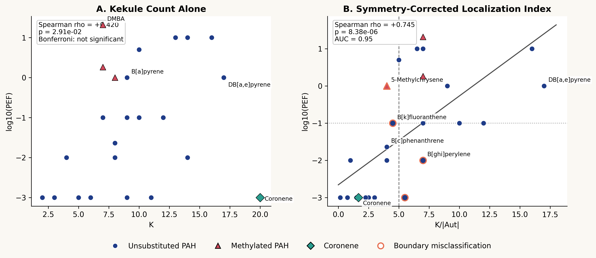
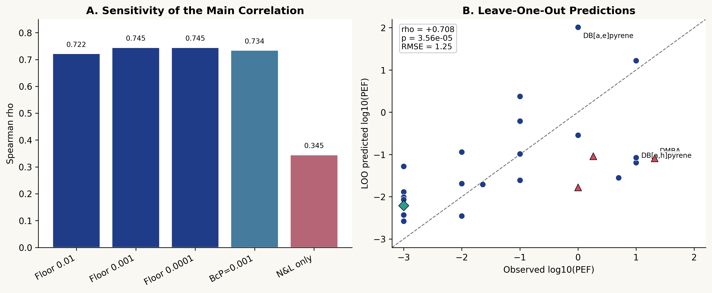
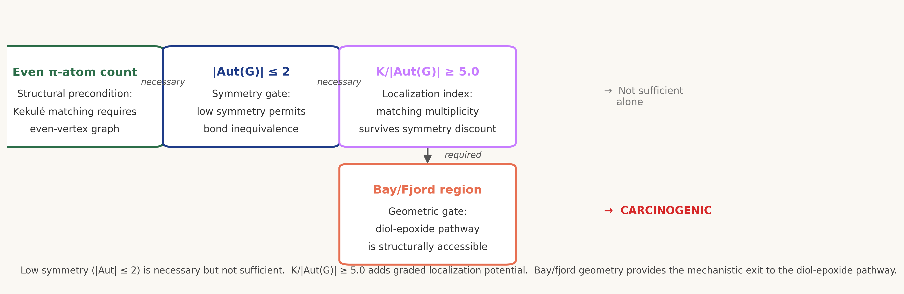

# Graph Symmetry and Kekulé Structure Localization Correlate with Carcinogenic Potency of Polycyclic Aromatic Hydrocarbons

Zhiwei Liu

Independent Researcher

---

## Abstract

The ratio of Kekule structure count (*K*) to graph automorphism group order (|Aut(*G*)|), a classical graph-theoretic quantity arising from Cyvin's analysis of benzenoid symmetry, has not, to our knowledge, been tested as a quantitative predictor of carcinogenic potency. Here *K*/|Aut(*G*)| correlated with regulatory potency equivalency factors (PEFs) across 27 polycyclic aromatic hydrocarbons (PAHs) with Spearman rho = +0.745 (95% CI +0.546 to +0.855; *p* = 8.38 x 10^-6), and remained predictive under leave-one-out cross-validation (rho = +0.708, *p* = 3.56 x 10^-5; RMSE = 1.25 log10 units). By contrast, the Kekule count *K* alone yielded a weaker correlation (Spearman rho = +0.420, raw *p* = 0.029) that did not pass the 17-predictor Bonferroni correction (adjusted *p* = 0.495; Benjamini-Hochberg q = 0.031). In binary classification at PEF >= 0.1, *K*/|Aut(*G*)| achieved area under the receiver operating characteristic curve (AUC) = 0.95; the threshold *K*/|Aut(*G*)| >= 5.0 yielded 11 true positives, 12 true negatives, 2 false negatives, and 2 false positives. The two false negatives were 5-methylchrysene and benzo[*k*]fluoranthene; the two false positives were benzo[*ghi*]perylene and benzo[*e*]pyrene, the latter sitting at the classification boundary (*K*/|Aut| = 5.5) and lacking a bay region, illustrating how the descriptor and geometric criterion work in tandem. The largest regression error was DMBA, consistent with steric effects from methyl substitution not encoded in the pi-system graph. These results formalize and quantify the classical intuitions of Pullman (bond localization), Clar (sextet locking), and Cyvin (symmetry partitioning of Kekule structures) within a single transparent descriptor that connects molecular graph symmetry to CYP1-mediated metabolic activation. The result was robust to dataset composition: restricting the analysis to the 14 EPA Priority PAHs with Nisbet-LaGoy potency values yielded rho = +0.759 (*p* = 0.0016, AUC = 0.95), confirming that the correlation is not an artifact of the extended dataset. Coronene, which has the highest *K* in the dataset (*K* = 20) yet negligible potency, illustrates why *K* alone fails: D6h symmetry (|Aut| = 12) drives bond-order equalization, reducing *K*/|Aut(*G*)| to 1.67.

---

## 1. Introduction

### 1.1 The PAH Carcinogenicity Problem

Polycyclic aromatic hydrocarbons (PAHs) are ubiquitous environmental carcinogens formed during incomplete combustion. Their carcinogenic potential varies over four orders of magnitude: benzo[*a*]pyrene (BaP) is classified as a Group 1 human carcinogen by the International Agency for Research on Cancer (IARC), while structurally similar molecules such as triphenylene and coronene show little or no carcinogenic activity in standard bioassays despite comparable molecular size and lipophilicity.

The bay-region diol-epoxide hypothesis, established by Jerina, Sims, and others, provides the accepted mechanistic framework: CYP1A1/1B1 enzymes epoxidize a C=C double bond adjacent to a bay region, producing a diol-epoxide that reacts with deoxyguanosine N² to form a mutagenic DNA adduct. This hypothesis correctly identifies bay-region geometry as important for carcinogenicity but does not quantitatively predict potency differences among bay-region PAHs.

### 1.2 Quantitative Prediction Approaches

QSAR approaches have used increasingly complex descriptors. Coluci et al. applied pattern recognition with topological indices to 81 PAHs. Chen et al. employed 33 Dragon molecular descriptors with random forest models for CYP1A1 metabolism prediction. Fradkin et al. developed CONCERTO, a graph neural network for carcinogenicity classification. Li et al. applied random forests with Dragon descriptors to 91 PAHs. Vijayalakshmi and Suresh used molecular electrostatic potentials at the B3LYP level to construct a QSAR for 28 PAHs. These approaches require either three-dimensional coordinates, quantum chemical calculations, or large pretrained models, limiting mechanistic transparency.

### 1.3 Classical Intuitions: Pullman, Clar, and Cyvin

The present work draws on three classical theoretical frameworks. Pullman and Pullman (1955) showed that high pi-electron density at the K region correlated with PAH carcinogenicity, establishing that electronic localization — not merely molecular size — determines bioactivation potential. Clar's aromatic sextet theory (1972) provided a complementary chemical intuition: PAHs with maximal aromatic sextets (fully benzenoid hydrocarbons) are kinetically inert because their pi-electrons are maximally delocalized, whereas PAHs with migrating sextets have localized double bonds susceptible to electrophilic attack. Cyvin (1983) provided the group-theoretical foundation by explicitly analyzing the symmetry properties of Kekulé structures in benzenoid hydrocarbons, showing how the molecular automorphism group partitions Kekulé structures into orbits and constrains Pauling bond orders.

### 1.4 Present Contribution

Despite these classical insights, we know of no prior quantitative test of the ratio *K*/|Aut(*G*)| against a regulatory toxicological endpoint. Related graph-theoretic work (Morikawa, Narita, and Klein, 2004) partitions PAHs into Kekulean substructures (ethylene, benzene, annulene, and radialene units) to quantify local π-electron capacity, but does not form a scalar ratio linking global Kekule count to the automorphism group order nor benchmark against carcinogenic potency data. Here we show that the single ratio *K*/|Aut(*G*)| correlates with PEFs across 27 PAHs spanning more than four orders of magnitude in potency. The contribution is not a new mathematical descriptor but, to our knowledge, the first quantitative application of a classical graph-theoretic invariant to regulatory PAH carcinogenic potency data. Just as importantly, the 27-molecule dataset exposes the descriptor's boundary conditions: unsubstituted PAHs are predicted substantially better than methylated PAHs, and once the carcinogenicity threshold is crossed, bay/fjord topology still modulates potency within the carcinogenic class.

## 2. Computational Methods

### 2.1 Dataset

Twenty-seven PAHs were selected comprising 14 of the 16 EPA Priority PAHs (excluding acenaphthene and fluorene, whose sp3 bridging carbons preclude a fully conjugated pi-system), supplemented by benzene, perylene, triphenylene, coronene, benzo[*e*]pyrene, 5-methylchrysene, DMBA, 3-methylcholanthrene, benzo[*c*]phenanthrene, and four dibenzopyrene isomers (dibenzo[*a*,*e*]pyrene, dibenzo[*a*,*h*]pyrene, dibenzo[*a*,*i*]pyrene, and dibenzo[*a*,*l*]pyrene). SMILES were checked against PubChem CIDs, and the pi-system graph was defined by removing exocyclic methyl carbons from methylated PAHs. The dataset includes both benzenoid (all six-membered rings) and non-benzenoid PAHs (fluoranthene, acenaphthylene) containing five-membered rings; the Kekule counting formalism applies to both classes. The four dibenzopyrene isomers share the molecular formula C24H14 but differ in ring-fusion topology, providing a controlled comparison in which molecular size, elemental composition, and lipophilicity are held constant while *K*, |Aut(*G*)|, and bay/fjord geometry vary. Benzo[*e*]pyrene was included as a structural isomer of benzo[*a*]pyrene (C20H12), providing a controlled test of whether the descriptor discriminates two molecules identical in formula and lipophilicity but differing in ring-fusion position; this isomer pair is analyzed in §3.6.

### 2.2 Carcinogenic Potency

Potency was quantified as PEFs relative to BaP (PEF = 1.0) using a three-tier source hierarchy plus one explicitly labeled proxy. Non-carcinogenic EPA PAHs used TEFs from Nisbet and LaGoy (1992). The four dibenzopyrene isomers used PEFs from Collins et al. (1998). DMBA and 3-methylcholanthrene, which are not covered in environmental PEF tables, used oral cancer slope factors from the OEHHA cancer potency database divided by the historical CalEPA BaP slope factor of 12 (mg/kg-day)^-1, yielding PEFs of 20.83 and 1.83, respectively. Benzo[*c*]phenanthrene lacks a published carcinogenic PEF; a mutagenic equivalency factor (MEF = 0.023) from Durant et al. was therefore used as a proxy and carried as an explicit sensitivity case. PAHs with no published potency data and no evidence of carcinogenicity above background (benzene, benzo[*e*]pyrene, coronene, perylene, triphenylene) were assigned PEF = 0.001 (floor value reflecting "no observable activity in standard bioassays"; the value 0.001 rather than zero is required for log10 transformation). Sensitivity analyses addressed both floor assignment and the uncertain benzo[*c*]phenanthrene value.

### 2.3 Kekulé Count and Automorphism Group Order

The pi-system was defined as atoms classified aromatic by RDKit plus sp2-carbon atoms in ring-embedded C=C bonds. Exocyclic methyl substituents were excluded. Kekulé structure counts were computed by recursive perfect-matching enumeration, validated against literature values from Cyvin and Gutman [8] for eight reference compounds (benzene through BaP; exact match in all cases); for dibenzo[*a*,*h*]pyrene (*K* = 13) and dibenzo[*a*,*i*]pyrene (*K* = 14), no tabulated literature values were located and the computed values are reported as primary. The automorphism group order |Aut(*G*)| for the pi-system graph was determined from the planar graph automorphism group (rotations and in-plane reflections preserving vertex adjacency), which for PAHs corresponds to the rotational-reflective subgroup of the molecular point group restricted to the molecular plane. All |Aut(*G*)| values were verified by algorithmic enumeration of graph automorphisms using the VF2 algorithm as implemented in NetworkX 3.x (Python); the verification script is provided in the Supporting Information repository.

### 2.4 Statistical Methods

Spearman rank correlations were used throughout. The five primary predictors motivated by the mechanistic hypothesis were *K* alone, |Aut(*G*)| alone, the ratio *K*/|Aut(*G*)|, a binary bay/fjord region indicator, and the product *K*/|Aut(*G*)| × bay. To protect against selective-reporting concerns, we subsequently declared and tested twelve additional predictors drawn from established molecular graph theory and standard physicochemical descriptors: vertex count *N*ᵥ, edge count *N*ₑ, ring count *N*ᵣ, Randić connectivity ¹χ, Wiener number *W*, Hosoya index *Z*, Balaban index *J*, first and second Zagreb indices *M*₁ and *M*₂, largest adjacency-matrix eigenvalue λ₁, XLogP3 (PubChem), and molecular weight (MW). All 17 predictors were evaluated against log₁₀(PEF) under both Bonferroni correction (multiplicity factor 17, family-wise α = 0.05) and Benjamini-Hochberg FDR control (q < 0.05); both adjusted values are reported jointly in §3.2. The 12-predictor extension was decided after the primary analysis was complete and is therefore reported as a multiplicity audit rather than as a pre-registered test set. Fisher exact tests were used for 2 × 2 tables. Leave-one-out cross-validation (LOO-CV) was performed by fitting a linear regression on 26 PAHs and predicting the excluded PAH's log₁₀(PEF). ROC AUC was computed for binary carcinogenicity (PEF ≥ 0.1).

## 3. Results

### 3.1 *K* Alone Does Not Predict Carcinogenic Potency

Across 27 PAHs, the Kekule count showed only a modest correlation with log10(PEF) (Spearman rho = +0.420, raw *p* = 0.029). Under the 17-predictor correction declared in §2.4, *K* alone did not survive Bonferroni control (adjusted *p* = 0.495), though it was retained under Benjamini-Hochberg FDR at q < 0.05 (q = 0.031). Because it is subsumed by the *K*/|Aut(*G*)| ratio in both effect size and FDR ranking, we do not report it as a primary predictor. **[Figure 1A]** The failure is exemplified by coronene (*K* = 20, PEF = 0.001) and DMBA (*K* = 7, PEF = 20.83): raw multiplicity of perfect matchings does not distinguish globally delocalized high-symmetry systems from low-symmetry systems in which a smaller set of Kekule structures can still localize bond order.

### 3.2 |Aut(*G*)| and *K*/|Aut(*G*)| Are Strong Predictors

The automorphism order |Aut(*G*)| correlated negatively with log10(PEF) (rho = -0.688, raw *p* = 7.38 x 10^-5; Bonferroni ×17 = 1.25 x 10^-3; BH q = 2.51 x 10^-4), and the ratio *K*/|Aut(*G*)| correlated more strongly and in the expected positive direction (rho = +0.745, raw *p* = 8.38 x 10^-6; Bonferroni ×17 = 1.42 x 10^-4; BH q = 4.75 x 10^-5). **[Figure 1B]** An ordinary least-squares line gives log10(PEF) = 0.239 x *K*/|Aut| - 2.659 (R^2 = 0.436), but the Spearman correlation and the binary analyses below should be regarded as primary because the floor values assigned to minimally active PAHs compress the lower tail.

The fact that |Aut(*G*)| alone is already predictive matters mechanistically: low symmetry is itself a precondition for bond-order differentiation. Yet |Aut(*G*)| by itself does not encode how many Kekule patterns remain available once symmetry is broken. *K*/|Aut(*G*)| therefore improves on |Aut(*G*)| by combining symmetry breaking with matching multiplicity. This is exactly the point made by the coronene paradox: *K* is large, but large symmetry neutralizes it.

Results for all 17 tested predictors (5 primary plus 12 added as part of the multiplicity audit declared in §2.4) under both Bonferroni (×17) and Benjamini-Hochberg FDR corrections are summarized below, sorted by |rho|.

| Predictor | rho | *p* (raw) | Bonferroni ×17 | BH q | Bonf α = 0.05 | BH q < 0.05 |
|-----------|-----|-----------|----------------|------|---------------|-------------|
| *K*/\|Aut\| × Bay | +0.834 | 6.68 × 10^−8 | 1.14 × 10^−6 | 1.14 × 10^−6 | Yes | Yes |
| Bay/fjord region | +0.802 | 4.83 × 10^−7 | 8.21 × 10^−6 | 4.11 × 10^−6 | Yes | Yes |
| *K*/\|Aut(*G*)\| | +0.745 | 8.38 × 10^−6 | 1.42 × 10^−4 | 4.75 × 10^−5 | Yes | Yes |
| Molecular weight | +0.690 | 6.79 × 10^−5 | 1.15 × 10^−3 | 2.51 × 10^−4 | Yes | Yes |
| \|Aut(*G*)\| | −0.688 | 7.38 × 10^−5 | 1.25 × 10^−3 | 2.51 × 10^−4 | Yes | Yes |
| Balaban *J* | −0.680 | 9.46 × 10^−5 | 1.61 × 10^−3 | 2.68 × 10^−4 | Yes | Yes |
| Wiener *W* | +0.645 | 2.79 × 10^−4 | 4.75 × 10^−3 | 6.79 × 10^−4 | Yes | Yes |
| XLogP3 | +0.625 | 4.90 × 10^−4 | 8.33 × 10^−3 | 1.04 × 10^−3 | Yes | Yes |
| *N*ᵥ (vertices) | +0.575 | 1.69 × 10^−3 | 2.87 × 10^−2 | 3.19 × 10^−3 | Yes | Yes |
| *N*ₑ (edges) | +0.545 | 3.26 × 10^−3 | 5.53 × 10^−2 | 5.03 × 10^−3 | No | Yes |
| Zagreb *M*₁ | +0.545 | 3.26 × 10^−3 | 5.53 × 10^−2 | 5.03 × 10^−3 | No | Yes |
| Randić ¹χ | +0.511 | 6.46 × 10^−3 | 1.10 × 10^−1 | 9.16 × 10^−3 | No | Yes |
| Hosoya *Z* | +0.490 | 9.53 × 10^−3 | 1.62 × 10^−1 | 1.18 × 10^−2 | No | Yes |
| Zagreb *M*₂ | +0.488 | 9.75 × 10^−3 | 1.66 × 10^−1 | 1.18 × 10^−2 | No | Yes |
| *N*ᵣ (rings) | +0.470 | 1.33 × 10^−2 | 2.26 × 10^−1 | 1.51 × 10^−2 | No | Yes |
| *K* alone | +0.420 | 2.91 × 10^−2 | 4.95 × 10^−1 | 3.09 × 10^−2 | No | Yes |
| λ₁ (adj. eigenvalue) | +0.280 | 1.57 × 10^−1 | 1.00 | 1.57 × 10^−1 | No | No |

Nine of 17 predictors survive Bonferroni × 17 at α = 0.05; sixteen of 17 survive BH FDR at q < 0.05; only the largest adjacency eigenvalue λ₁ fails under both. *K* alone survives BH but not Bonferroni, consistent with §3.1. The full ranking preserves the mechanistic hierarchy: the composite *K*/|Aut| × Bay leads all descriptors, and the graph-theoretic predictors *K*/|Aut(*G*)|, |Aut(*G*)|, and Balaban *J* all outrank the physicochemical comparators (MW, XLogP3), while the undifferentiated-size descriptors (*N*ᵥ, *N*ₑ, Zagreb *M*₁) fall below the interpretable invariants. Hosoya *Z* — structurally correlated with *K* — sits only slightly above *K* alone and does not threaten the positioning of *K*/|Aut(*G*)|.

**Table 1.** Complete 27-PAH descriptor set with binary classification at *K*/|Aut(*G*)| ≥ 5.0.

| # | Compound | *K* | \|Aut(*G*)\| | *K*/\|Aut\| | PEF | log₁₀(PEF) | Bay/Fjord | Classif.ᵃ |
|---|----------|-----|------------|-----------|-----|-----------|-----------|-----------|
| 1 | Benzene | 2 | 12 | 0.17 | 0.001 | −3.00 | N | TN |
| 2 | Naphthalene | 3 | 4 | 0.75 | 0.001 | −3.00 | N | TN |
| 3 | Acenaphthylene | 3 | 2 | 1.50 | 0.001 | −3.00 | N | TN |
| 4 | Fluoranthene | 6 | 2 | 3.00 | 0.001 | −3.00 | N | TN |
| 5 | Anthracene | 4 | 4 | 1.00 | 0.01 | −2.00 | N | TN |
| 6 | Phenanthrene | 5 | 2 | 2.50 | 0.001 | −3.00 | Y | TN |
| 7 | Pyrene | 6 | 4 | 1.50 | 0.001 | −3.00 | N | TN |
| 8 | Triphenylene | 9 | 6 | 1.50 | 0.001 | −3.00 | N | TN |
| 9 | Chrysene | 8 | 2 | 4.00 | 0.01 | −2.00 | Y | TN |
| 10 | Benz[*a*]anthracene | 7 | 1 | 7.00 | 0.1 | −1.00 | Y | TP |
| 11 | Benzo[*c*]phenanthrene | 8 | 2 | 4.00 | 0.023 | −1.64 | Y† | TN |
| 12 | Benzo[*a*]pyrene | 9 | 1 | 9.00 | 1.0 | 0.00 | Y | TP |
| 13 | 3-Methylcholanthrene | 7 | 1 | 7.00 | 1.833 | +0.26 | Y | TP |
| 14 | 5-Methylchrysene | 8 | 2 | 4.00 | 1.0 | 0.00 | Y | FN |
| 15 | DMBA | 7 | 1 | 7.00 | 20.83 | +1.32 | Y | TP |
| 16 | Dibenz[*a*,*h*]anthracene | 10 | 2 | 5.00 | 5.0 | +0.70 | Y | TP |
| 17 | Dibenzo[*a*,*l*]pyrene | 16 | 1 | 16.00 | 10.0 | +1.00 | Y | TP |
| 18 | Benzo[*b*]fluoranthene | 10 | 1 | 10.00 | 0.1 | −1.00 | Y | TP |
| 19 | Benzo[*k*]fluoranthene | 9 | 2 | 4.50 | 0.1 | −1.00 | Y | FN |
| 20 | Perylene | 9 | 4 | 2.25 | 0.001 | −3.00 | N | TN |
| 21 | Benzo[*ghi*]perylene | 14 | 2 | 7.00 | 0.01 | −2.00 | N | FP |
| 22 | Coronene | 20 | 12 | 1.67 | 0.001 | −3.00 | N | TN |
| 23 | Indeno[1,2,3-*cd*]pyrene | 12 | 1 | 12.00 | 0.1 | −1.00 | Y | TP |
| 24 | Dibenzo[*a*,*e*]pyrene | 17 | 1 | 17.00 | 1.0 | 0.00 | Y | TP |
| 25 | Dibenzo[*a*,*h*]pyrene | 13 | 2 | 6.50 | 10.0 | +1.00 | Y | TP |
| 26 | Dibenzo[*a*,*i*]pyrene | 14 | 2 | 7.00 | 10.0 | +1.00 | Y | TP |
| 27 | Benzo[*e*]pyrene | 11 | 2 | 5.50 | 0.001 | −3.00 | N | FP |

ᵃ Classification at threshold *K*/|Aut(*G*)| ≥ 5.0 (predicted carcinogen) vs. PEF ≥ 0.1 (observed carcinogen). TP = true positive; TN = true negative; FP = false positive; FN = false negative. Summary: TP = 11, TN = 12, FP = 2, FN = 2.
† Benzo[*c*]phenanthrene has a fjord region rather than a standard bay region; classified as bay/fjord = Y because fjord geometry similarly enables diol-epoxide formation.

Figure 1. Main quantitative result panels. Left: *K* alone does not survive multiplicity correction. Right: *K*/|Aut(*G*)| strengthens the rank correlation, while the two false negatives (5-methylchrysene, benzo[*k*]fluoranthene) and two false positives (benzo[*ghi*]perylene, benzo[*e*]pyrene) visibly define the model boundary rather than being hidden from it.

### 3.3 Robustness: Sensitivity Analysis and Cross-Validation

The rank correlation was stable to the floor values assigned to minimally active compounds: rho = +0.722 at floor = 0.01, rho = +0.745 at floor = 0.001, and rho = +0.745 at floor = 0.0001. The more important sensitivity test concerned benzo[*c*]phenanthrene, the only compound without a published carcinogenic PEF. Reassigning benzo[*c*]phenanthrene from the Durant proxy (0.023) to a conservative floor value of 0.001 reduced the correlation only modestly (rho = +0.734, *p* = 1.30 x 10^-5; AUC unchanged at 0.95), indicating that the main conclusion does not hinge on this single proxy value. By contrast, collapsing all non-EPA extension molecules to N&L floor values weakens the signal substantially (rho = +0.345, *p* = 0.078; AUC = 0.79); the informative claim is therefore not that the result is independent of all source choices, but that it remains stable within a source hierarchy that preserves the chemically informative extension set.

As an additional check, restricting the analysis to the 14 EPA Priority PAHs with Nisbet-LaGoy PEFs yielded rho = +0.759 (*p* = 0.0016, *n* = 14; AUC = 0.95), confirming that the correlation does not depend on the extension molecules. A complementary test excluded the three methylated PAHs (DMBA, 3-methylcholanthrene, 5-methylchrysene), since methyl substitution introduces steric and metabolic effects outside the pi-system graph (§4.3); the resulting 24-compound subset yielded rho = +0.775 for *K*/|Aut(*G*)| (Bonferroni ×17 = 1.46 × 10^-4; AUC at PEF ≥ 1 = 0.87), giving Δrho = +0.031 relative to the full 27-PAH dataset and confirming that the correlation is not carried by the three methylated outliers.

In a floor-independent binary analysis (carcinogen: PEF >= 0.1 vs. non-carcinogen), the threshold *K*/|Aut| >= 5.0 yielded 11 true positives, 12 true negatives, 2 false negatives, and 2 false positives (Fisher odds ratio = 33.0, *p* = 4.23 x 10^-4). The false negatives were 5-methylchrysene and benzo[*k*]fluoranthene; the false positives were benzo[*ghi*]perylene and benzo[*e*]pyrene. The Youden J-statistic maximizes at *K*/|Aut(*G*)| = 4.5 rather than 5.0. The two candidate thresholds give near-equivalent classification performance: at *K*/|Aut(*G*)| >= 4.5, (TP, TN, FP, FN) = (12, 12, 2, 1); at *K*/|Aut(*G*)| >= 5.0, (TP, TN, FP, FN) = (11, 12, 2, 2). We report 5.0 as the primary threshold on chemical rather than statistical grounds: it coincides with dibenz[*a*,*h*]anthracene (*K*/|Aut(*G*)| = 5.00, PEF = 5.0), a regulated carcinogen in the primary source hierarchy that anchors the lower chemically informative boundary. Because the primary quantitative claims — the threshold-free Spearman rho and AUC — do not depend on this choice, binary classification is reported as an illustrative second readout rather than the primary inference. ROC analysis of *K*/|Aut(*G*)| as a continuous predictor yielded AUC = 0.95 (Figure S1).

Leave-one-out cross-validation yielded rho = +0.708 (*p* = 3.56 x 10^-5) between predicted and observed log10(PEF), with RMSE = 1.25 log10 units. Decomposing LOO error by substitution status, unsubstituted PAHs (*n* = 24) had RMSE = 1.15, whereas the three methylated PAHs had RMSE = 1.88. The largest single error was DMBA (observed +1.32, predicted −1.09, error +2.41), confirming that the major failures are driven by substituent-dependent steric and metabolic effects not captured by the pi-only graph.

**[Figure 2: Sensitivity analysis panel + LOO-CV predicted vs actual]**

Figure 2. Robustness analyses for the symmetry-corrected descriptor. Left: floor sensitivity is modest, while collapsing all extension molecules to N&L floor values weakens the signal, showing that the defensible claim is source-hierarchy robustness rather than abstract source-independence. Right: LOO predictions preserve rank structure but fail systematically on methylated PAHs and on the extreme dibenzopyrene boundary case DB[a,e]P.

### 3.4 Three-Variable Hierarchical Model

Combining *K*/|Aut(*G*)| with bay-region annotation yields a hierarchical classification:

1. **Even pi-atom count** (structural constraint, not a fitted variable): All unsubstituted PAHs have even pi-counts; odd-count molecules (*K* = 0) are structurally excluded from C=C epoxidation.
2. **|Aut(*G*)| <= 2** (Fisher OR = infinity, *p* = 5.80 x 10^-3): low symmetry permits Kekule-structure localization.
3. **Bay/fjord region** (Fisher OR = infinity, *p* = 3.39 x 10^-5): geometry specifies access to the diol-epoxide pathway.

This hierarchy clarifies the relation between |Aut(*G*)| and *K*/|Aut(*G*)|. Low symmetry is close to a necessary condition in this dataset: no compound with |Aut| > 2 is carcinogenic. But low symmetry alone is not sufficient, because the non-carcinogenic set still contains seven compounds with |Aut| <= 2. The ratio *K*/|Aut(*G*)| therefore acts as a graded within-class discriminator, while bay/fjord topology determines whether that localization can be converted into the canonical carcinogenic pathway.

**[Figure 3: Mechanism flowchart]**

Figure 3. Hierarchical interpretation of the model. Even pi-count is the structural precondition, low symmetry opens the space of inequivalent bonds, *K*/|Aut(*G*)| measures how much localization potential remains after symmetry discounting, and bay/fjord topology specifies whether that localization can exit through the canonical diol-epoxide mechanism.

### 3.5 Coronene: Bond-Order Equalization by Symmetry

Coronene exemplifies the framework. IARC classifies coronene as Group 3 (not classifiable as to its carcinogenicity to humans; IARC Monograph 92, 2010), based on limited evidence: a negative skin-painting study and a positive initiation–promotion assay. Coronene is Ames-positive in TA98 with S9 activation (Florin et al. 1980) but not in TA100, suggesting a mutagenicity mechanism (possibly DNA intercalation) distinct from the diol-epoxide pathway characteristic of carcinogenic PAHs such as BaP.

With *K* = 20 and |Aut| = 12, coronene's *K*/|Aut| = 1.67 places it firmly in the non-carcinogenic range. Exact Pauling bond-order enumeration (SI) partitions coronene's 30 bonds into three D6h equivalence classes: inner hub ring (6 bonds, *p* = 0.70), spoke bonds (6 bonds, *p* = 0.40), and outer rim (18 bonds, *p* = 0.30). The maximum bond order of 0.70 is distributed across six symmetry-equivalent inner bonds, none of which is positioned at a bay region.

By contrast, BaP (*K* = 9, |Aut| = 1, *K*/|Aut| = 9.0) has no nontrivial symmetry: all 24 bonds are inequivalent, with Pauling bond orders spanning 0.11 to 0.89 (range 0.78). The maximum *p* = 8/9 ≈ 0.889 is carried by a single unique bond — the bay-region C=C double bond targeted by CYP1A1 epoxidation.

The mechanistic contrast is therefore not simply that BaP has a wider bond-order range than coronene (though it does: 0.78 versus 0.40). The deeper point is that BaP's maximum bond order is *geometrically positioned* at the bay-region bond that the enzyme must activate, whereas coronene's near-equivalent maximum (0.70) sits on hub bonds with no bay-region access. *K*/|Aut(*G*)| captures both contributions simultaneously: the numerator *K* measures how many localized Kekulé patterns are available, while |Aut(*G*)| corrects for the fraction of those patterns that are symmetry-equivalent and therefore cannot differentiate specific bonds for selective epoxidation. The bay-region criterion then acts as the second filter, selecting only those molecules where the localization produced by low symmetry is geometrically accessible to CYP1.

**[Figure 4: Coronene vs BaP structural comparison with bond-order distribution]**

![Figure 4. Coronene versus benzo[a]pyrene structural and descriptor contrast.](figures/fig4_coronene_bap_v4.png)

Figure 4. Coronene versus benzo[*a*]pyrene. Coronene wins on raw multiplicity (*K* = 20) but loses after symmetry correction because D6h symmetry compresses distinct Kekule arrangements into equivalent bond classes. BaP has fewer matchings but no nontrivial symmetry, preserving localized bond-order contrast relevant to bay-region bioactivation.

### 3.6 Benzo[*a*]pyrene vs. Benzo[*e*]pyrene: Symmetry Discriminates Isomers

Benzo[*a*]pyrene (BaP) and benzo[*e*]pyrene (BeP) share the molecular formula C20H12 and differ only in the position of ring fusion. BaP (*K* = 9, |Aut| = 1, *K*/|Aut| = 9.0) is classified by IARC as Group 1 (carcinogenic to humans), while BeP (*K* = 11, |Aut| = 2, *K*/|Aut| = 5.5) is classified as Group 3 (not classifiable as to carcinogenicity). Despite BeP having a higher Kekulé count, its C2 symmetry reduces *K*/|Aut| below BaP's value. Critically, BeP also lacks a bay region, and it is IARC Group 3 with assigned floor PEF = 0.001.

At the threshold *K*/|Aut| >= 5.0, BeP is classified as a predicted carcinogen (5.5 >= 5.0) but observed non-carcinogen (PEF = 0.001 < 0.1), making it one of two false positives in the 27-PAH dataset (alongside benzo[*ghi*]perylene). BeP thus locates where the *K*/|Aut(*G*)| threshold alone is insufficient: molecules with 5.0 ≤ *K*/|Aut(*G*)| ≤ 6.0 and no bay region fall in the ambiguous zone in which the geometric criterion becomes the decisive discriminator. BaP (*K*/|Aut| = 9.0, bay region present) and BeP (*K*/|Aut| = 5.5, no bay region) together show that the two components of the hierarchical model — localization index and geometric accessibility — are not redundant.

A notable structural coincidence emerged from the corrected descriptor values: benzo[*c*]phenanthrene (BcP) and chrysene are graph-isomorphic — their π-system graphs are identical under vertex relabeling, yielding the same *K* = 8, |Aut(*G*)| = 2, and *K*/|Aut| = 4.00. Despite their different three-dimensional geometries (chrysene is planar; BcP adopts a helical conformation due to steric crowding at the fjord region), the descriptor correctly predicts both as non-carcinogens at the threshold *K*/|Aut| < 5.0. This coincidence is mechanistically coherent: the fjord geometry that distinguishes BcP from chrysene reduces, rather than enhances, productive CYP1 binding through steric clash, consistent with the low MEF of BcP (0.023) relative to bay-region PAHs of comparable *K*/|Aut|.

## 4. Discussion

### 4.1 Relationship to Classical Theories

*K*/|Aut(*G*)| provides a single computable quantity that unifies three classical perspectives. The Pullman K-region electron density correlates with Pauling bond-order maxima, which occur at bonds not averaged by the automorphism group; *K*/|Aut| quantifies the degree to which such averaging occurs. Clar's observation that fully benzenoid PAHs are inert corresponds to high-|Aut| molecules whose sextets cannot migrate; *K*/|Aut| is low when sextets are locked by symmetry. Cyvin's group-theoretical treatment of Kekulé structures provides the mathematical foundation; the present work extends it to a quantitative toxicological prediction.

The coronene–BaP comparison (§3.5) makes the mechanism precise. The critical contrast is not simply that BaP has a wider bond-order range than coronene — though it does (0.78 vs. 0.40). It is that BaP's maximum Pauling bond order (*p* = 8/9 ≈ 0.89) is localized on the bay-region C=C bond, while coronene's maximum (*p* = 0.70), distributed symmetrically across six equivalent inner-ring bonds, has no bay-region position at which CYP1 can direct its attack. *K*/|Aut(*G*)| therefore encodes two things jointly: whether a molecule has enough localization potential to produce a high-bond-order bond, and whether symmetry has broken that potential specifically enough to concentrate it. The bay/fjord criterion then acts as the third filter, selecting only molecules where that concentrated bond order is geometrically accessible.

The novelty of this contribution lies not in inventing a new descriptor, which would be misleading, but in showing that this old descriptor becomes chemically legible once paired with a toxicological endpoint and an explicit mechanistic boundary. Whereas Morikawa, Narita, and Klein (2004) decompose PAH Kekule spaces into localized substructure components (ethylene, benzene, annulene, and radialene units) to characterize π-electron capacity, the present work aggregates the same combinatorial substrate into a single symmetry-normalized scalar *K*/|Aut(*G*)| and tests it against regulatory potency data. The result does not replace multidescriptor QSAR models on raw predictive accuracy. Its value is that one number can be read directly from the molecular graph, interpreted in bond-order terms, and situated inside the accepted bioactivation mechanism.

A natural question is whether |Aut(*G*)| alone suffices. It does not: |Aut(*G*)| is a coarse structural gate, whereas *K*/|Aut(*G*)| is a localization index. The former says whether symmetry strongly constrains bond inequivalence; the latter says how much matching multiplicity remains after symmetry has been discounted. Coronene and triphenylene make the first point, while dibenzopyrene isomers make the second: once the automorphism class is small, differences in *K* still matter.

### 4.2 Mechanistic Limitations

The mechanistic argument connecting *K*/|Aut| to CYP1 catalysis has two acknowledged limitations. First, Pauling bond orders are a Kekulé-level approximation; for intermediate-symmetry molecules, the correspondence with true electron density from DFT is imperfect. The coronene–BaP comparison provides a useful internal consistency check: X-ray crystallography (Faulkner 1966) yields coronene bond lengths from 1.346 to 1.433 Å (variation 0.087 Å), and the computed Pauling bond-order range for coronene (0.30–0.70, range 0.40) versus BaP (0.11–0.89, range 0.78) gives a 49% reduction — directionally consistent with the 38% reduction in bond-length variation, confirming that the two approaches agree in ordering. The non-identity of the two percentages (49% vs. 38%) is expected because bond-length–bond-order relationships are nonlinear for condensed aromatics, and because X-ray values include thermal motion effects. For smaller PAHs with intermediate symmetry, DFT validation would be needed to confirm that Pauling bond orders correctly identify the highest-electron-density C=C bond.

Second, CYP1 substrate selectivity depends on factors beyond bond-order localization, including active-site fit, planarity, and substrate orientation relative to the heme iron. Coronene's large size (24 pi-atoms) may additionally limit productive binding within the CYP1A1 active-site cavity, providing a steric explanation complementary to the electronic one. However, steric exclusion alone cannot explain the inactivity of triphenylene (18 pi-atoms, comparable to the active carcinogen chrysene), which the automorphism framework correctly predicts: triphenylene (|Aut| = 6, *K*/|Aut| = 1.5) has high symmetry that prevents localization, whereas chrysene (|Aut| = 2, *K*/|Aut| = 4.0) does not.

### 4.3 Methylated PAH Limitation

The LOO-CV analysis revealed that methylated PAHs are the systematic failure mode. DMBA is the largest error in the dataset, and 5-methylchrysene is a binary false negative despite inheriting chrysene's pi-graph descriptor. These are not nuisances to be hidden; they define the model boundary. Methyl groups at bay- or fjord-adjacent positions alter steric exposure, active-site orientation, and downstream detoxification in ways the pi-system graph cannot represent. The appropriate claim is therefore not "graph theory is sufficient for PAHs" but "graph topology captures a major component of potency for unsubstituted PAHs, while substituted PAHs require additional steric and metabolic descriptors."

### 4.4 Dibenzopyrene Isomers: A Controlled Comparison

The four carcinogenic dibenzopyrene isomers (C24H14) provide a uniquely controlled test of the framework, because molecular formula, molecular weight, and lipophilicity are fixed while ring-fusion topology varies. All four have *K*/|Aut| >= 5 and are correctly classified as carcinogens (PEF >= 0.1). However, the quantitative potency ranking within this isomer set is only partially captured: dibenzo[*a*,*e*]pyrene (*K*/|Aut| = 17.0) has the highest ratio but the lowest PEF (1.0), whereas dibenzo[*a*,*h*]pyrene (*K*/|Aut| = 6.5) and dibenzo[*a*,*i*]pyrene (*K*/|Aut| = 7.0) both reach PEF = 10. This is not a failure of the main claim. It shows that *K*/|Aut| is strongest as a threshold-level carcinogenicity descriptor and weaker as a fine-grained potency ranker once all molecules already possess multiple high-risk topological motifs. Within that regime, fjord/bay geometry and metabolic channel choice become the next discriminating variables. The fifth isomer, dibenzo[*e*,*l*]pyrene (PubChem CID 9122), gives *K* = 20, |Aut| = 4, and *K*/|Aut| = 5.0, sitting exactly on the empirical threshold while lacking a standardized PEF assignment in the present dataset.

### 4.5 Scope

The model is specific to the CYP1-mediated bay-region diol-epoxide pathway, for which CYP1A1/1B1 substrate selectivity has been characterized with recombinant enzymes. It should not be inflated into a universal carcinogenicity theory. IARC Group 3 PAHs assigned nominal floor values (benzene, benzo[*e*]pyrene, coronene, perylene, triphenylene) may still have weak or context-dependent activities below the resolution of the present endpoint. Conversely, boundary cases such as benzo[*k*]fluoranthene show that a threshold model will always generate near-cutoff ambiguity. The proper scope claim is therefore modest but defensible: for largely unsubstituted PAHs with established diol-epoxide chemistry, symmetry-corrected Kekule multiplicity captures a substantial and mechanistically interpretable fraction of carcinogenic potency.

### 4.6 Connection to the Broader CYP1–AhR Signalling Axis

Beyond the carcinogenicity endpoint, the same CYP1 substrate-selectivity argument extends to the duration of downstream aryl hydrocarbon receptor (AhR) activation: rapidly metabolised high-*K*/|Aut(*G*)| ligands produce transient AhR signalling, whereas sterically shielded or halogenated low-*K*/|Aut(*G*)| congeners sustain nuclear AhR occupancy [34, 35]. That immunopolarization-direction extension is developed quantitatively in a companion manuscript; the present paper establishes only the graph-theoretic substrate on which it rests.

## 5. Conclusion

The ratio *K*/|Aut(*G*)|, Kekule structure count divided by graph automorphism group order, correlates with PAH carcinogenic potency across a 27-molecule dataset (Spearman rho = +0.745, *p* = 8.38 x 10^-6; binary AUC = 0.95) while *K* alone does not. The descriptor resolves the coronene paradox, captures the carcinogenic threshold for all four dibenzopyrene isomers in the dataset, and situates classical PAH chemistry inside a quantitative graph-theoretic framework. Its strength is not universal prediction but transparent mechanism: symmetry-corrected matching multiplicity measures how much bond-order localization remains available to the bay/fjord-region bioactivation pathway. Its limitation is equally clear: methylated PAHs and within-class potency ranking require additional descriptors beyond the pi-system graph.

---

## References

1. Jerina, D. M.; Daly, J. W. *Science* **1974**, *185*, 573–582.
2. Sims, P.; et al. *Nature* **1974**, *252*, 326–328.
3. Collins, J. F.; et al. *J. Toxicol. Environ. Health B* **1998**, *1*, 45–67.
4. Nisbet, I. C. T.; LaGoy, P. K. *Regul. Toxicol. Pharmacol.* **1992**, *16*, 290–300.
5. Pullman, A.; Pullman, B. *Adv. Cancer Res.* **1955**, *3*, 117–169.
6. Clar, E. *The Aromatic Sextet*; Wiley: London, 1972.
7. Cyvin, S. J. *J. Mol. Struct.* **1983**, *100*, 75–92.
8. Cyvin, S. J.; Gutman, I. *Kekulé Structures in Benzenoid Hydrocarbons*; Springer: Berlin, 1988.
9. Gutman, I.; Cyvin, S. J. *Introduction to the Theory of Benzenoid Hydrocarbons*; Springer: Berlin, 1989.
10. Chen, C.; et al. *Sci. Total Environ.* **2020**, *758*, 143997.
11. Fradkin, P.; et al. *Bioinformatics* **2022**, *38*, i84–i91.
12. Li, N.; et al. *Anal. Methods* **2019**, *11*, 1816–1821.
13. Vijayalakshmi, K. P.; Suresh, C. H. *J. Comput. Chem.* **2008**, *29*, 1808–1817.
14. Shimada, T.; Fujii-Kuriyama, Y. *Cancer Sci.* **2004**, *95*, 1–6.
15. Shimada, T. *Toxicol. Res.* **2017**, *33*, 79–96.
16. Randić, M. *Chem. Rev.* **2003**, *103*, 3449–3606.
17. Solà, M. *Front. Chem.* **2013**, *1*, 22.
18. Florin, I.; et al. *Toxicology* **1980**, *18*, 219–232.
19. IARC. *IARC Monogr. Eval. Carcinog. Risks Hum.* **2010**, *92*, 1–853.
20. Gold, L. S.; et al. *Environ. Health Perspect.* **1999**, *107* (Suppl. 4), 527–600.
21. Lowe, J. P. *Int. J. Quantum Chem.* **1982**, *22*, 1051–1069.
22. Peruzzo, P. J.; et al. *J. Mol. Struct. (THEOCHEM)* **2003**, *631*, 97–105.
23. Wang, Y.; et al. *Chemosphere* **2020**, *268*, 129343.
24. Bernardo, D. L.; et al. *Quím. Nova* **2016**, *39*, 789–794.
25. Hecht, S. S.; et al. *Cancer Lett.* **1976**, *1*, 147–154.
26. Coluci, V. R.; et al. *J. Chem. Inf. Comput. Sci.* **2002**, *42*, 1479–1489.
27. Cavalieri, E. L.; Rogan, E. G. *Xenobiotica* **1995**, *25*, 677–688.
28. Shimada, T.; et al. *Chem. Res. Toxicol.* **1997**, *10*, 486–492.
29. Faulkner, R. A. *Proc. R. Soc. A* **1966**, *289*, 366–376.
30. Cavalieri, E. L.; et al. *J. Cancer Res. Clin. Oncol.* **1989**, *115*, 67–72.
31. Cavalieri, E. L.; et al. *Carcinogenesis* **1991**, *12*, 1939–1944.
32. Durant, J. L.; Busby, W. F., Jr.; Lafleur, A. L.; Penman, B. W.; Crespi, C. L. *Hum. Exp. Toxicol.* **1996**, *15* (Suppl. 1), S37-S42.
33. Office of Environmental Health Hazard Assessment (OEHHA). *Cancer Potency Values*; California Environmental Protection Agency: Sacramento, CA, 2009.
34. Quintana, F. J.; Basso, A. S.; Iglesias, A. H.; Korn, T.; Farez, M. F.; Bettelli, E.; Caccamo, M.; Oukka, M.; Weiner, H. L. *Nature* **2008**, *453*, 65–71.
35. Veldhoen, M.; Hirota, K.; Westendorf, A. M.; Buer, J.; Dumoutier, L.; Renauld, J. C.; Stockinger, B. *Nature* **2008**, *453*, 106–109.
36. Morikawa, T.; Narita, S.; Klein, D. J. Molecules-in-Molecule Estimation of the Extent of Localization of Kekuléan Substructures in Polycyclic Aromatic Hydrocarbons. *J. Chem. Inf. Model.* **2004**, *44* (6), 1891–1896. DOI: 10.1021/ci049894n.

---

## Supporting Information

Table S1: SMILES, PubChem CIDs, and verification status. Table S2: Complete 27-PAH descriptor table. Table S3: Sensitivity analysis for floor assignment and benzo[*c*]phenanthrene proxy assignment. Table S4: LOO-CV per-molecule predictions with RMSE decomposition (unsubstituted vs. methylated PAHs). Table S5: Dibenzopyrene isomer comparison including dibenzo[*e*,*l*]pyrene as a qualitative comparator. Figure S1: Receiver operating characteristic (ROC) curve for *K*/|Aut(*G*)| as predictor of binary carcinogenic status (AUC = 0.95). Python code for Kekulé counting, |Aut(*G*)| verification (NetworkX VF2 algorithm), Pauling bond-order enumeration, figure generation, and complete statistical audit (including bootstrap confidence intervals and EPA-only validation) available at https://github.com/mahpmice/pah-kekule-descriptor.

---

## Data Availability Statement

The 27-PAH dataset (SMILES, PubChem CIDs, computed descriptors, and PEF values with citable sources), all Python analysis scripts, and a reproducibility audit script that regenerates every reported statistic are openly available at https://github.com/mahpmice/pah-kekule-descriptor under the MIT License. PEF values are derived from publicly available regulatory documents (Nisbet and LaGoy 1992; Collins et al. 1998; OEHHA 2009) as described in §2.2.

---

## Author Information

### Corresponding Author

**Zhiwei Liu** — Independent Researcher; Email: mahpmiceliu@gmail.com; ORCID: https://orcid.org/0009-0004-3926-0720

### Notes

The author declares the following competing financial interest: Z. Liu is an inventor on U.S. Provisional Patent Application No. 64/037,961 (filed April 13, 2026), which covers the algebraic graph invariant methods for predicting carcinogenic potency described in this work.
